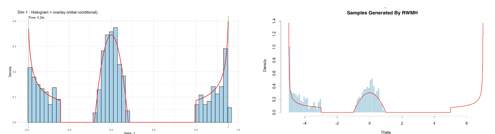
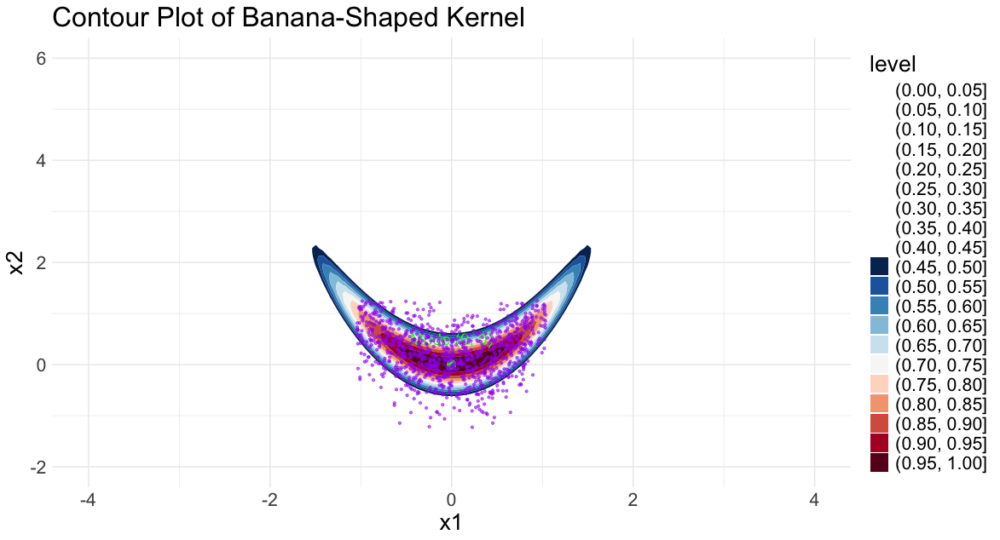
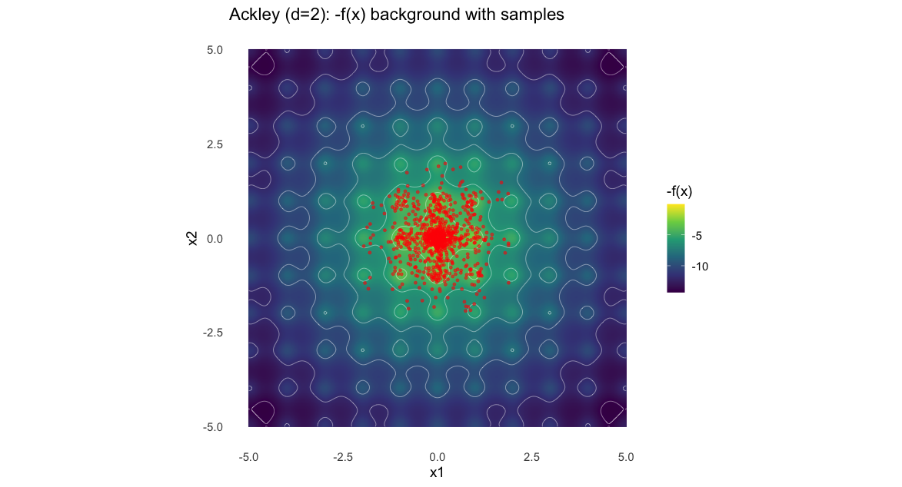
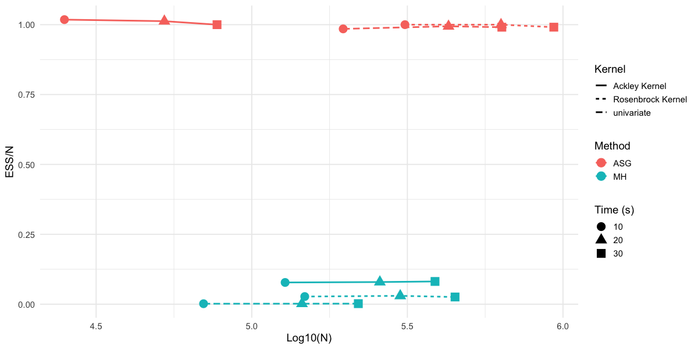
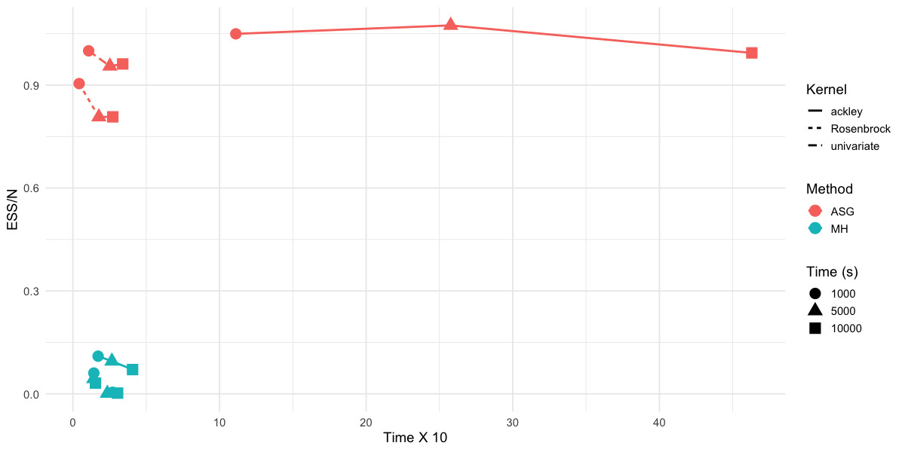

# Automated Sliced Gibbs Sampler for Arbitrary Kernels

The arxiv version of the article can be found here 

This repository contains the code and experiments accompanying the paper:

> **Automated Sliced Gibbs Sampler for Arbitrary Kernels**  
> **Prithwish Ghosh & Sujit K Ghosh**
> 
> Department of Statistics, North Carolina State University, Raleigh, NC, USA

## 📌 Overview

Statistical inference often requires sampling from complex and intractable probability distributions.  
We introduce an **automated Gibbs sampling framework** that integrates:

- **Adaptive effective support estimation**  
  Automatically identifies and normalizes the support of arbitrary univariate and multivariate kernels.  

- **Slice sampling updates**  
  Uses rejection-based slice sampling to handle nonstandard, multimodal, or highly correlated densities.  

- **Automated Gibbs composition**  
  Extends to multivariate settings without requiring manual bound specification.  

- **Diagnostic and time-based analysis**  
  Includes density overlays, trace plots, running means, autocorrelations, effective sample size (ESS), and ESS per second (ESS/s) for rigorous performance evaluation.  

Compared to Metropolis–Hastings (MH), the proposed method achieves **higher statistical efficiency** (greater ESS) and demonstrates **better time-aware performance** (higher ESS/s under fixed run times).  

---

## ✨ Key Features

- Works directly with **unnormalized kernels**.
- **Automatically infers dimension** by probing kernel evaluations.
- Provides **univariate slice updates** for each conditional distribution.
- Built-in diagnostics:
  - Density plots
  - Trace plots
  - Running mean plots
  - Autocorrelation plots
  - Effective sample size (ESS)
- **Time-based analysis**: evaluates efficiency using ESS per second (ESS/s).
- Tested on:
  - Univariate beta mixtures
  - Multivariate normal mixtures
  - Rosenbrock (“banana-shaped”) distribution
  - Ackley function

---

## 📊 Example Results

### Density recovery comparison (univariate conditional example)

<figure>
  

    
  

  <figcaption>
    

      <b>Figure 3:</b> sample histogram of ASG samples with density overlay computed from effective support estimation for univariate kernel.
    

  </figcaption>
</figure>

### Density recovery (Rosenbrock kernel conditional example)

<figure>
  

    
  

  <figcaption>
    

      <b>Figure 3:</b> Sample histogram of ASG samples with density overlay computed from effective support estimation for Rosenbrock kernel.
    

  </figcaption>
</figure>

### Density recovery (Ackley kernel conditional example)

<figure>
  

    
  

  <figcaption>
    

      <b>Figure 3:</b> Sample histogram of ASG samples with density overlay computed from effective support estimation for Ackleykernel.
    

  </figcaption>
</figure>

---

### Time-based efficiency (ESS/s)

The proposed sampler maintains higher ESS/s across varying run times, while MH degrades quickly.

<figure>
  

    
  

  <figcaption>
    

      <b>Figure 4:</b> Time-aware efficiency comparison using ESS/s. Higher is better.
    

  </figcaption>
</figure>

### Sample-based efficiency (ESS/s)

The proposed sampler maintains higher ESS/s across varying samples, while MH degrades quickly.

<figure>
  

    
  

  <figcaption>
    

      <b>Figure 4:</b> Sample-aware efficiency comparison using ESS/s. Higher is better.
    

  </figcaption>
</figure>

---

