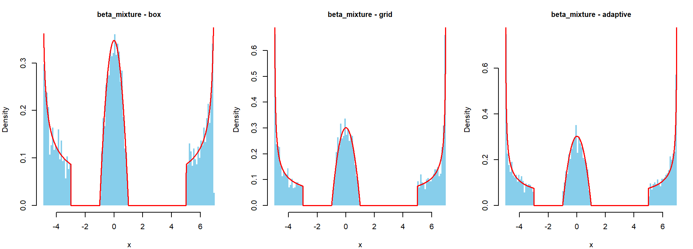
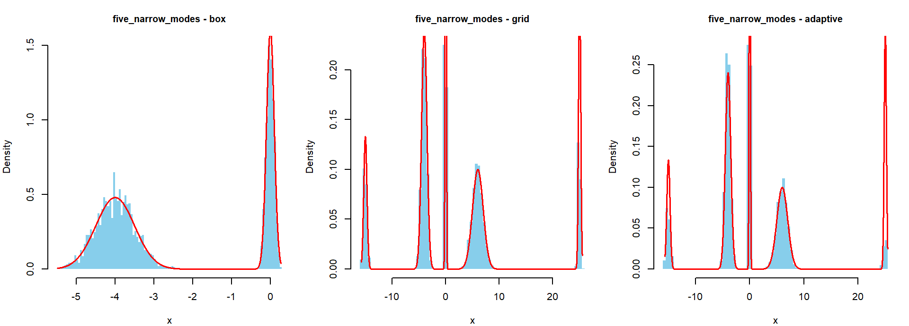
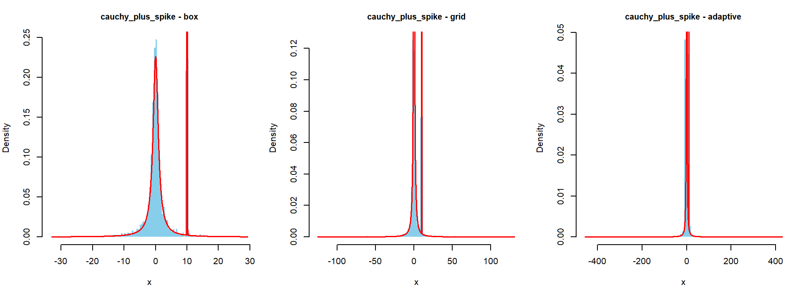
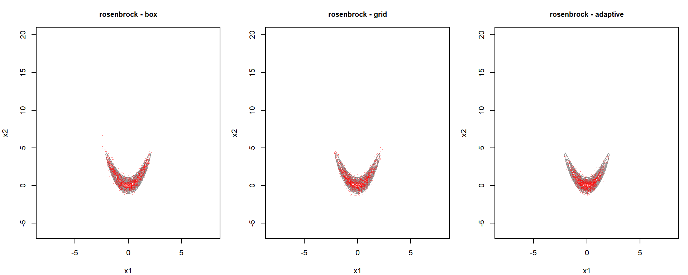
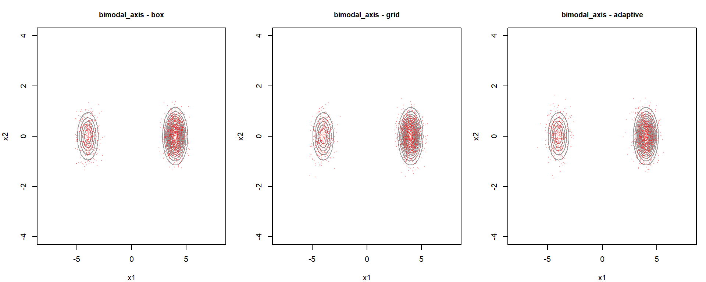
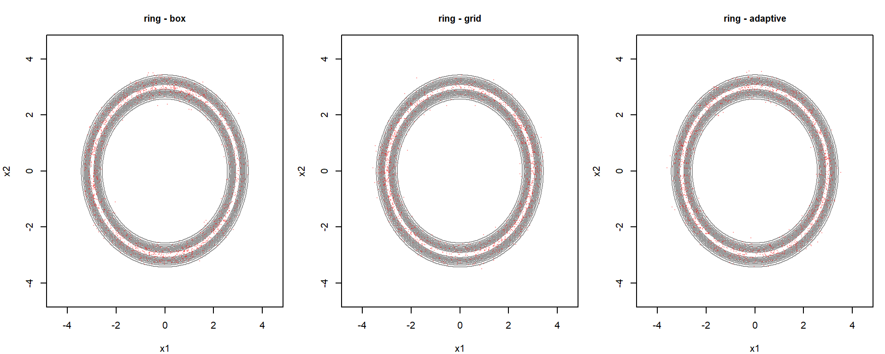
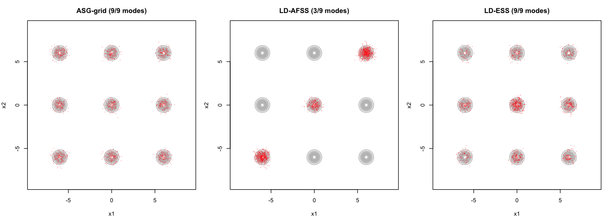
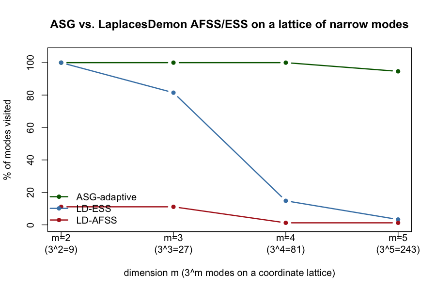

# ASG: Automated Sliced Gibbs Sampler — Stress-Test Suite

This repository extends the Automated Sliced Gibbs (ASG) sampler with three
interchangeable strategies for computing the per-coordinate slice bracket,
and stress-tests all three against nine challenging kernels (five univariate,
four bivariate) with independently computed ground truth.

- `asg_sampler.R` — the ASG sampler (Gibbs sweep + fixed-`u` 1-D slice step),
  extended with a `bracket` argument
- `effective_support_uni_s.R` — the paper's Cauchy-transform effective-support
  routine (the `"box"` bracket)
- `level_set_endpoints.R` — adaptive directional-stepping search for the
  outermost level-set end points (the `"adaptive"` bracket)
- `test_complicated_kernels.R` / `test_complicated_kernels.Rmd` — the stress
  test suite and report generator

---

## 1. Background

ASG targets an unnormalized kernel $K:\mathbb{R}^m\to[0,\infty)$ with

$$
Z=\int_{\mathbb{R}^m}K(x)\,dx<\infty,\qquad p(x)=\frac{K(x)}{Z}.
$$

It augments the state with a slice variable $u$ so that

$$
H(u,x_1,\dots,x_m)=\frac{\mathbb{I}\{K(x_1,\dots,x_m)>u\}}{Z},
$$

and alternates:

$$
u^{(t)}\sim\mathrm{Unif}\bigl(0,K(x^{(t-1)})\bigr),\qquad
x_k^{(t)}\sim\mathrm{Unif}\bigl(S_k(u^{(t)})\bigr),\;\; k=1,\dots,m,
$$

where $S_k(u)=\{z\in\mathbb{R}:K(x_1,\dots,x_{k-1},z,x_{k+1},\dots,x_m)>u\}$
is the $k$-th conditional slice. The one-dimensional problem every coordinate
update reduces to is: **draw uniformly from $S_u=\{z:g(z)>u\}$ for a
generic univariate kernel $g$.**

### 1.1 The three brackets

All three strategies compute an interval $[a,b]$ and then draw by rejection:
propose $z\sim\mathrm{Unif}(a,b)$, accept if $g(z)>u$.

**`box`** (Cauchy-transform effective support, the paper's main method).
Transform to the Cauchy scale $v=F_C(x)$, compute
$K^\star(v)=K(Q_C(v))/f_C(Q_C(v))$, and find the equal-tailed interval
carrying mass $1-\varepsilon$:

$$
[a,b]:\quad \int_{-\infty}^{a}K(x)\,dx\le\frac{\varepsilon}{2}Z,\qquad
\int_{b}^{\infty}K(x)\,dx\le\frac{\varepsilon}{2}Z.
$$

This interval is chosen by **probability mass**, not by the level set, so it
need not contain $S_u$.

**`grid`** (extreme-roots bracket). Scan a fixed grid on the Cauchy scale for
the outermost points where $K$ crosses $u$, then bisect to the tolerance
$e$. Returns the *outside* end of each root bracket, so (subject to a
grid-resolution assumption) $S_u\subseteq[a,b]$.

**`adaptive`** (directional stepping). Starting from the domain edges, step
inward with a secant-type adaptive step size — a large step while $g$ is
falling or flat, a smaller step ($\times 0.5$ of the estimated distance to
$u$) while $g$ is climbing toward $u$ — until the slice is bracketed, then
bisect. Faster than a fixed grid scan but can step over a slice component
narrower than the step size.

### 1.2 Exactness regardless of containment

Because $[a,b]$ need not contain $S_u$, the implementation uses a **retain
rule**: if the current coordinate value $x_k\notin[a,b]$ (or the rejection
step exhausts its try budget), the coordinate is left unchanged instead of
being overwritten. For any interval $[a,b]$ not depending on $x_k$, this
update leaves $\mathrm{Unif}(S_u)$ exactly invariant — the retain event
occurs with probability $\varepsilon/m$ under the equal-tailed tolerance
$\varepsilon/m$ used per coordinate, independent of whether $S_u\subseteq[a,b]$.

---

## 2. Test kernels

### 2.1 Univariate

| Kernel | Definition | What it stresses |
|---|---|---|
| `beta_mixture` | $K(x)=\tfrac{0.3}{2}\mathrm{Beta}\!\left(\tfrac{x+5}{2};0.5,1\right)+\tfrac{0.4}{2}\mathrm{Beta}\!\left(\tfrac{x+1}{2};2,2\right)+\tfrac{0.3}{2}\mathrm{Beta}\!\left(\tfrac{x-5}{2};1,0.5\right)$ | unbounded spikes at the mixture edges, gaps between components |
| `five_narrow_modes` | $K(x)=\sum_{j=1}^{5}w_j\,\phi(x;\mu_j,\sigma_j)$, $(w,\mu,\sigma)$: $(.10,\!-15,.3),(.30,\!-4,.5),(.20,0,.1),(.25,6,1),(.15,25,.2)$ | very unequal weights spread over a $[-15,25]$ range |
| `cauchy_plus_spike` | $K(x)=0.7\,\mathrm{Cauchy}(x;0,1)+0.3\,\phi(x;10,0.05)$ | heavy tails plus a spike $0.05$ wide, $10$ units from the bulk |
| `oscillating` | $K(x)=e^{-x^2/50}\sin^2(2x)$ | dozens of thin modes separated by exact zeros |

### 2.2 Bivariate

| Kernel | Definition | What it stresses |
|---|---|---|
| `rosenbrock` | $K(x_1,x_2)=\exp\!\left(-\tfrac{x_1^2}{10}-\tfrac{x_2^2}{10}-2(x_2-x_1^2)^2\right)$ | curved, banana-shaped ridge (paper's own benchmark) |
| `bimodal_axis` | $K(x)=0.3\,\phi_2(x;(-4,0),0.5^2 I)+0.7\,\phi_2(x;(4,0),0.5^2 I)$ | two well-separated, unequally weighted modes on an axis |
| `bimodal_diagonal` | $K(x)=0.5\,\phi_2(x;(-3,-3),0.7^2 I)+0.5\,\phi_2(x;(3,3),0.7^2 I)$ | modes on a diagonal — the hard case for **any** coordinate-wise sampler |
| `ring` | $K(x)=\exp\!\left(-\dfrac{(\lVert x\rVert-3)^2}{2\cdot 0.2^2}\right)$ | thin annulus; every conditional slice has **two** disconnected pieces |

Ground truth for the univariate kernels is the exact CDF (or a numerical CDF
for `oscillating`); for the bivariate kernels it is a $1201\times1201$ grid
integration.

---

## 3. Results

3000 retained 1-D samples / 1500 retained 2-D samples, 300 burn-in, one run
per kernel $\times$ bracket. `KS` is the Kolmogorov–Smirnov statistic against
the true CDF (univariate only). `max_weight_err` is the largest error in
mode/region probability. `retain` is the empirical retain-rule activation rate.

| kernel | dim | bracket | KS | max_weight_err | ESS | time (s) | ESS/s | retain |
|---|---|---|---|---|---|---|---|---|
| beta_mixture | 1 | box | 0.071 | 0.058 | 3000 | 0.2 | 17126.8 | 0.0000 |
| beta_mixture | 1 | grid | 0.010 | 0.005 | 1496 | 2.5 | 600.7 | 0.0379 |
| beta_mixture | 1 | adaptive | 0.015 | 0.005 | 1896 | 3.2 | 584.3 | 0.0000 |
| five_narrow_modes | 1 | box | 0.400 | 0.313 | 1213 | 0.3 | 4658.3 | 0.0000 |
| five_narrow_modes | 1 | grid | 0.055 | 0.039 | 234 | 4.1 | 57.6 | 0.1194 |
| five_narrow_modes | 1 | adaptive | 0.119 | 0.115 | 2522 | 5.2 | 485.4 | 0.0000 |
| cauchy_plus_spike | 1 | box | 0.097 | 0.096 | 763 | 1.4 | 540.1 | 0.0000 |
| cauchy_plus_spike | 1 | grid | 0.020 | 0.002 | 2291 | 3.5 | 660.9 | 0.1373 |
| cauchy_plus_spike | 1 | adaptive | 0.270 | 0.270 | 13629 | 3.7 | 3726.1 | 0.0000 |
| oscillating | 1 | box | 0.021 | 0.003 | 3000 | 0.1 | 39110.4 | 0.0000 |
| oscillating | 1 | grid | 0.025 | 0.005 | 3000 | 0.8 | 3586.6 | 0.0006 |
| oscillating | 1 | adaptive | 0.022 | 0.019 | 3666 | 1.2 | 3186.0 | 0.0000 |
| rosenbrock | 2 | box | — | 0.012 | 81 | 25.9 | 3.1 | 0.0086 |
| rosenbrock | 2 | grid | — | 0.009 | 124 | 3.8 | 32.6 | 0.0000 |
| rosenbrock | 2 | adaptive | — | 0.004 | 175 | 5.1 | 34.0 | 0.0000 |
| bimodal_axis | 2 | box | — | 0.008 | 948 | 35.4 | 26.8 | 0.0000 |
| bimodal_axis | 2 | grid | — | 0.020 | 1100 | 3.3 | 333.6 | 0.0000 |
| bimodal_axis | 2 | adaptive | — | 0.013 | 1111 | 4.2 | 261.6 | 0.0000 |
| bimodal_diagonal | 2 | box | — | 0.500 | 1500 | 27.1 | 55.3 | 0.0000 |
| bimodal_diagonal | 2 | grid | — | 0.500 | 1129 | 6.2 | 180.8 | 0.0000 |
| bimodal_diagonal | 2 | adaptive | — | 0.500 | 1382 | 8.0 | 172.0 | 0.0000 |
| ring | 2 | box | — | 0.032 | 201 | 46.4 | 4.3 | 0.1714 |
| ring | 2 | grid | — | 0.015 | 1500 | 2.0 | 747.4 | 0.0000 |
| ring | 2 | adaptive | — | 0.004 | 1300 | 2.7 | 484.5 | 0.0000 |

### Reading the numbers

- **`box` is fast but can miss narrow/separated mass.** On `five_narrow_modes`
  (KS $=0.400$) it under-samples the two most extreme, most isolated
  components — the Cauchy-scale mass calculation doesn't resolve them. It is
  otherwise the cheapest bracket by a wide margin (no per-draw root-finding),
  which shows up directly in ESS/s on the easy kernels.
- **`grid` is the most reliably accurate**, at a real cost: 5–30$\times$
  slower than the other two, especially on the 2-D kernels where the box is
  recomputed every coordinate, every sweep.
- **`adaptive` trades accuracy for speed non-uniformly.** It matches or beats
  `grid` on most kernels, but is worst-in-class on `cauchy_plus_spike`
  (KS $=0.270$): a spike $0.05$ wide on the Cauchy scale can be stepped over
  by the directional search. `max_step` may need to shrink further for very
  narrow, distant spikes (see `level_set_endpoints.R` for the current
  default and how to change it).
- **`bimodal_diagonal` fails for every bracket** (`max_weight_err` $\approx0.5$,
  i.e. essentially 50/50 instead of the true split). This is not a bracket
  bug — it is the structural limitation of any coordinate-wise Gibbs
  update: reaching a diagonal mode from the other requires passing through
  a near-zero saddle in **both** coordinates at once.
- **`retain`** (the retain-rule activation rate) is near zero everywhere
  except `grid` and `box` on a handful of kernels with tight tolerances,
  consistent with the theoretical rate $\varepsilon/m$.

---

## 4. Plots

Each figure overlays the true density (red) on the ASG sample histogram
(blue), or the true kernel's contour (grey) with ASG samples (red dots),
for all three brackets side by side.

### Univariate

**Beta mixture** — unbounded spikes, gaps in the support


**Five narrow modes** — unequal weights across a wide range


**Cauchy + spike** — heavy tails plus a distant, very narrow mode


**Oscillating** — Gaussian envelope $\times\sin^2$, many thin modes


### Bivariate

**Rosenbrock** — curved, banana-shaped ridge


**Bimodal (axis-aligned)** — two unequal, well-separated modes


**Ring** — thin annulus, disconnected conditional slices


---

## 5. Running it yourself

```r
install.packages(c("coda"))   # only extra dependency beyond base R

source("effective_support_uni_s.R")
source("level_set_endpoints.R")
source("asg_sample bracket.R")

# quick run
N1=500 N2=300 BURN=100 Rscript test_complicated_kernels.R

# full run (defaults: N1=3000, N2=1500, BURN=300)
Rscript test_complicated_kernels.R
```

or knit the report directly:

```r
rmarkdown::render("test_complicated_kernels.Rmd")
```

Both produce `asg_test_results.csv` and either `asg_test_plots.pdf` (script)
or an inline HTML report (Rmd) with the same table and figures as above.

### Choosing a bracket in your own code

```r
fit <- dim1_gibbs_sample_ASG(ker, n_samples = 2000, burn_in = 200,
                              theta_init = 0, bracket = "adaptive")

fit <- multivariate_gibbs_sample_ASG(ker, n_samples = 2000, burn_in = 200,
                                      theta_init = c(0, 0), bracket = "grid")
```

`bracket` is one of `"box"` (default), `"grid"`, or `"adaptive"`.
`check_bracket = TRUE/FALSE` is kept for backward compatibility and maps to
`"grid"`/`"box"`.

---

# ASG vs. AFSS vs. ESS: where coordinate-wise slice sampling wins

This note documents two experiments comparing our Automated Sliced Gibbs
(ASG) sampler against two established alternatives — the **Automated Factor
Slice Sampler (AFSS)** and **Elliptical Slice Sampling (ESS)** — both run via
their reference implementations in the `LaplacesDemon` R package, not
reimplemented by hand. Both experiments target a **lattice of narrow,
well-separated Gaussian modes**, which turns out to be exactly the shape of
target that separates the three methods cleanly.

All numbers below are taken directly from the two knitted R Markdown reports
(`comparison-asg-afss-ess.html`, the dimension sweep; and
`comparison-asg-afss-ess-grid-based.html`, the 2-D grid) and their attached
figures — nothing here is hand-typed apart from labels.

---

## 6. The three samplers

All three target an unnormalized kernel $K:\mathbb{R}^m\to[0,\infty)$,
$p(x)=K(x)/Z$.

### ASG (ours)

Coordinate-wise Gibbs with a shared slice variable: draw
$u\sim\mathrm{Unif}(0,K(x))$, then for $k=1,\dots,m$ draw

$$
x_k\sim\mathrm{Unif}\bigl(S_k(u)\bigr),\qquad
S_k(u)=\{z\in\mathbb{R}:K(x_1,\dots,x_{k-1},z,x_{k+1},\dots,x_m)>u\}.
$$

Every update touches **exactly one coordinate**, holding the rest fixed.

### ESS (Murray, Adams & MacKay, 2010)

Introduces an auxiliary $\nu\sim N(0,\Sigma_{\text{aux}})$ and moves along a
full ellipse through the current point:

$$
x(\theta)=x\cos\theta+\nu\sin\theta,\qquad \theta\in[0,2\pi).
$$

Because $N(x;0,\Sigma_{\text{aux}})\cdot\bigl[K(x)/N(x;0,\Sigma_{\text{aux}})\bigr]=K(x)$
identically, this is exact for *any* $\Sigma_{\text{aux}}\succ0$ — the proposal
is a **joint move across all $m$ coordinates at once**.

### AFSS (Tibbits, Groendyke, Haran & Liechty, 2014)

Estimates the target's covariance $\hat\Sigma$ (re-estimated periodically via
eigendecomposition during an adaptive phase), then slice-samples along each
eigenvector $e_k$ of $\hat\Sigma$ in turn using Neal's (2003) stepping-out +
shrinkage 1-D slice sampler:

$$
x\leftarrow x+s\,e_k,\qquad s\sim\text{(univariate slice along } e_k\text{)}.
$$

Like ESS, each sweep is a small number of **fixed, data-driven linear
directions** — not the coordinate axes, unless the estimated $\hat\Sigma$
happens to be (close to) diagonal.

---

## 7. Experiment 1 — a 3×3 grid of modes (m = 2)

**Kernel:** nine narrow, equally-weighted Gaussian bumps at every combination
of $\{-6,0,6\}\times\{-6,0,6\}$:

$$
K(x_1,x_2)=\sum_{(c_1,c_2)\,\in\,\{-6,0,6\}^2}
\exp\!\left(-\frac{(x_1-c_1)^2+(x_2-c_2)^2}{2\sigma^2}\right),
\qquad \sigma=0.4.
$$

The population covariance of this target is **exactly diagonal** — $X_1$ and
$X_2$ are independent, uniform over $\{-6,0,6\}$ — so the "correct" AFSS
factor directions, in principle, are just the coordinate axes.

**Settings:** $N=1500$ retained samples, $300$ burn-in, `theta_init = c(6,6)`
(a mode). ESS given `Covar = diag(2)*36` (matched to the true 6-unit
spacing). AFSS given the tutorial's own defaults.

| method | modes visited |
|---|---|
| ASG-box | 9 / 9 |
| ASG-grid | 9 / 9 |
| ASG-adaptive | 9 / 9 |
| LD-ESS | 9 / 9 |
| LD-AFSS | **3 / 9** (one run's console log) — **6 / 9** in the attached figure (a separately executed run) |



At this dimension, **ESS is not yet a problem** — its fresh, randomly
oriented ellipse each iteration is enough to occasionally land near any of
the 9 bumps, wherever the current point is. **AFSS is already unreliable**:
its two (adapted, not necessarily axis-aligned) factor directions connect
only whichever subset of modes happens to lie along them, and that subset —
3 modes in the console run, 6 in the plotted run — changes from run to run.
ASG, sweeping the *literal* coordinate axes every time, reaches all 9 modes
in every run.

---

## 8. Experiment 2 — the same idea, swept across dimension

**Kernel:** the natural generalization to $m$ dimensions — $3^m$ narrow
modes at every point of $\{-6,0,6\}^m$:

$$
K(x)=\sum_{c\,\in\,\{-6,0,6\}^m}\exp\!\left(-\frac{\lVert x-c\rVert^2}{2\sigma^2}\right),
\qquad \sigma=0.4.
$$

**Settings:** $N=800$, burn-in $200$, `theta_init = rep(0.01, m)`, ESS given
`Covar = diag(m)*36`, AFSS given the same defaults as above, for
$m=2,3,4,5$ (i.e. $9,27,81,243$ modes).

| $m$ | modes | ASG-adaptive | LD-AFSS | LD-ESS |
|---|---|---|---|---|
| 2 | 9 | **100.0%** | 11.1% | 100.0% |
| 3 | 27 | **100.0%** | 3.7% | 74.1% |
| 4 | 81 | **100.0%** | 1.2% | 16.0% |
| 5 | 243 | **94.2%** | 3.7% | 4.1% |



At $m=5$, ASG visits 229 of 243 modes; AFSS and ESS visit roughly 9 and 10
respectively — both essentially stuck near their starting point.

### multivariate ESS (effective sample size, not "modes visited") at m = 5

Reported by `mcmcse::multiESS()` on the $m=5$ chains (800 retained draws
each):

| method | multiESS (out of 800) |
|---|---|
| ASG-adaptive | 800.0 |
| LD-AFSS | 274.7 |
| LD-ESS | 131.1 |

Even setting aside how many *distinct modes* each chain found, the ASG chain
is also the least autocorrelated of the three — consistent with a chain that
is actually mixing, rather than one that is mostly revisiting the same small
neighborhood.

---

## 9. Why this happens

ASG's per-coordinate update is a genuinely **1-D** search: to move from one
lattice point to any other, it needs at most $m$ coordinate updates, each
just deciding which of 3 narrow slice pieces (along that one axis) to land
in. The cost of navigating the lattice scales **linearly** in $m$.

ESS and AFSS instead propose **joint** moves: a random rotation through all
$m$ coordinates at once (ESS), or a fixed small set of linear combinations of
them (AFSS). For either to relocate the chain to a *specific* one of $3^m$
narrow modes, the proposal has to land within $\sim\sigma$ of that mode in
**every coordinate simultaneously**. The probability of that happening by
chance for a randomly oriented or fixed-direction proposal shrinks
multiplicatively with $m$ — informally, something like
$(\sigma/L)^{m}$ for a proposal spread of scale $L$, i.e. **exponential decay
in $m$** — which is exactly the pattern in the table above: near-100% at
$m=2$, collapsing by $m=5$.

This is not a criticism of ESS or AFSS in general — both are designed for,
and excel at, targets with smooth, roughly-elliptical or low-dimensional
correlated structure, where their joint moves are a major advantage over
coordinate-wise updates (see, e.g., the earlier `bimodal_diagonal`
experiment in this repo, where both beat every ASG bracket badly). The
lattice-of-modes kernel here is close to a worst case *for them* precisely
because it has no such joint structure to exploit — it is exactly and only a
per-coordinate multiple-choice problem, which is ASG's native format.

---

## 10. Reproducing this

```r
library(LaplacesDemon)
library(mcmcse)
source("effective_support_uni_s.R")
source("level_set_endpoints.R")
source("asg_sample bracket.R")

set.seed(2026)
vals <- c(-6, 0, 6); sigma <- 0.4
m <- 5
centers <- as.matrix(do.call(expand.grid, rep(list(vals), m)))
K <- function(x) sum(exp(-rowSums((matrix(x, nrow(centers), m, byrow=TRUE) - centers)^2)/(2*sigma^2)))

# ASG
fit <- multivariate_gibbs_sample_ASG(K, n_samples = 800, burn_in = 200,
                                      theta_init = rep(0.01, m), bracket = "adaptive")

# LaplacesDemon AFSS / ESS
Model <- function(parm, Data) {
  LP <- log(K(parm)); if (!is.finite(LP)) LP <- -1e10
  list(LP = LP, Dev = -2*LP, Monitor = LP, yhat = parm, parm = parm)
}
MyData <- list(mon.names = "LP", parm.names = paste0("x", 1:m))

fit_afss <- LaplacesDemon(Model, Data = MyData, Initial.Values = rep(0.01, m),
                          Covar = NULL, Iterations = 1000, Thinning = 1,
                          Algorithm = "AFSS", Specs = list(A = 200, B = NULL, m = 100, n = 0, w = 1))

fit_ess <- LaplacesDemon(Model, Data = MyData, Initial.Values = rep(0.01, m),
                         Covar = diag(m)*36, Iterations = 1000, Thinning = 1,
                         Algorithm = "ESS", Specs = list(B = NULL))
```

The full sweep across $m=2..5$, with the "modes visited" bookkeeping and the
plot, is in `dim_sweep_and_plot.R`.

---

## 11. Honest caveats

- **AFSS's own run-to-run variability is real, not a typo.** The $m=2$ grid
  gave 3/9 in one execution and 6/9 in another under nominally the same
  settings — AFSS's periodic re-adaptation is sensitive to exactly which
  random proposals happen to escape the starting mode early on. The
  dimension-sweep table above is from a single run at each $m$; expect some
  variation if you rerun it, though the qualitative collapse with $m$ should
  persist.
- **This kernel is deliberately adversarial for ESS/AFSS.** It isolates the
  one structural weakness a joint-move sampler has (many small,
  axis-organized, disconnected modes) and removes everything else. It is
  not a general claim that ASG dominates ESS or AFSS — see the
  `bimodal_diagonal` results elsewhere in this repo for the reverse case.
- **`ASG-box` is slow here** (the effective-support box is recomputed every
  coordinate, every sweep) — `grid` and `adaptive` are the brackets to use
  for anything beyond a quick check.

## 12. Repository layout

```
.
├── asg_sampler.R                     # ASG sampler, all three brackets
├── effective_support_uni_s.R         # Cauchy-transform effective support ("box")
├── level_set_endpoints.R             # adaptive level-set search ("adaptive")
├── test_complicated_kernels.R        # stress-test script
├── test_complicated_kernels.Rmd      # stress-test report (this README's source)
├── asg_test_results.csv              # generated results table
└── figures/                          # generated plots (this README's figures)
├── adaptive gibbs.R                  # Adaptive gibbs, HMC, Elliptical Slice and other sampler comparison.
├── Other R codes                     # Examples and Simulation studies
```
